# LeKiwi Agent System: Architecture and Implementation Guide

## Table of Contents

1. [Overview](#overview)
2. [System Architecture](#system-architecture)
3. [Data Flow Diagrams](#data-flow-diagrams)
4. [State Machine](#state-machine)
5. [Component Specifications](#component-specifications)
6. [Data Strategy and Training](#data-strategy-and-training)
7. [Implementation Phases](#implementation-phases)
8. [Engineering Guidelines](#engineering-guidelines)
9. [References](#references)

---

## Overview

**Goal**: Build a robot agent for LeKiwi that executes natural-language tasks such as "fetch me a tissue": understand the command, navigate indoors, detect and approach the tissue, pick it up, return to the user, and communicate status/errors.

**Approach**: Staged development from heuristic MVP to learned policies, inspired by:
- **OmniVLA**: Omni-modal navigation with topological memory
- **MBRA/LogoNav**: Data relabeling and long-horizon navigation
- **Gemini Robotics 1.5**: Agentic tool orchestration

---

## System Architecture

### Hardware Setup

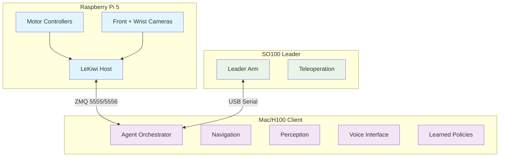

### Network Communication

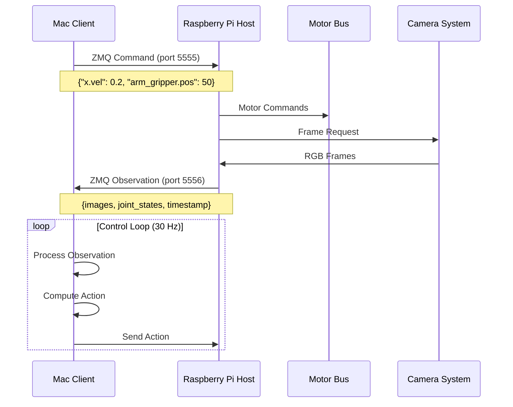

---

## Data Flow Diagrams

### End-to-End Information Flow

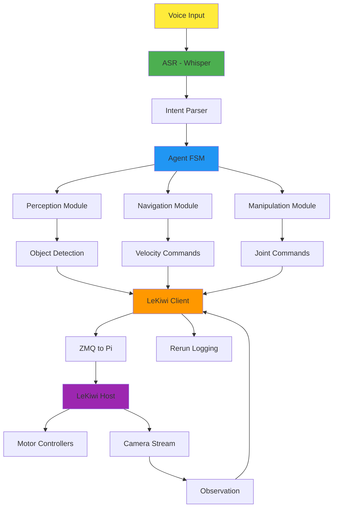

### Perception Pipeline

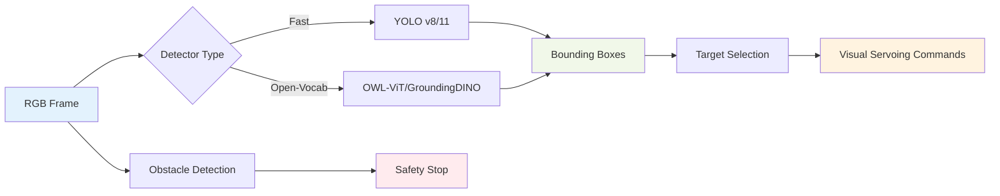

---

## State Machine

### Agent States

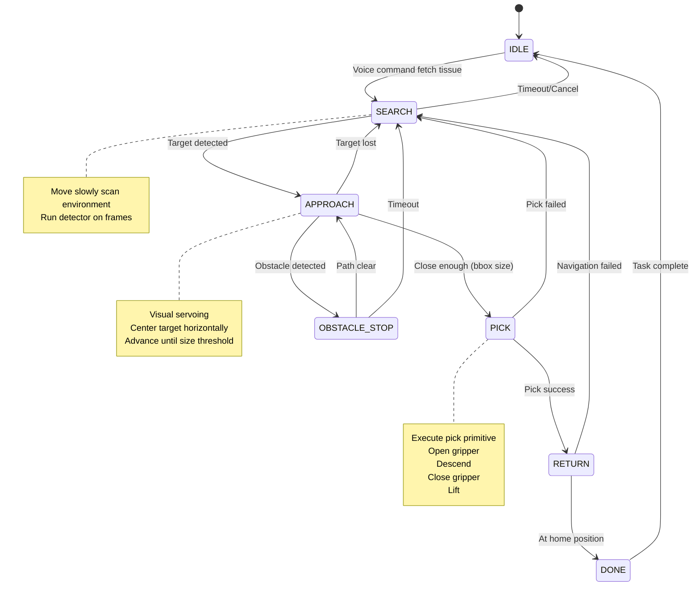

### Navigation State Details

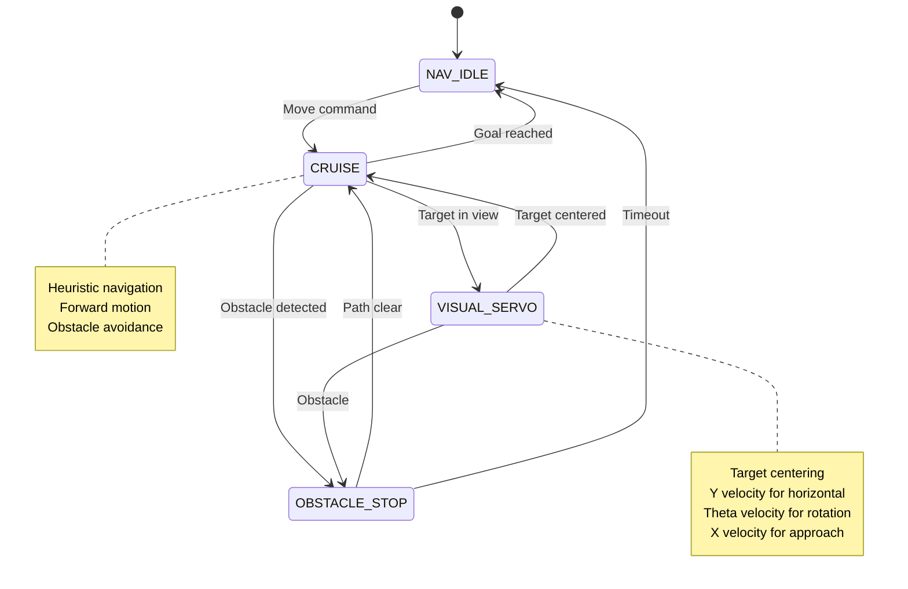

---

## Component Specifications

### 1. Agent Orchestrator

**Responsibilities:**
- Finite state machine management
- Module coordination
- Error handling and recovery

**API:**
```python
class Agent:
    def __init__(self, robot: LeKiwiClient, modules: dict):
        self.state = AgentState.IDLE
        self.robot = robot
        self.navigator = modules['navigator']
        self.detector = modules['detector']
        self.picker = modules['picker']
        self.returner = modules['returner']
    
    def handle_command(self, text: str) -> None:
        """Parse voice command and set target"""
        
    def step(self, obs: dict) -> dict:
        """Execute one FSM step, return action"""
        
    def get_status(self) -> dict:
        """Return current state and diagnostics"""
```

### 2. Perception Module

**Responsibilities:**
- Object detection (target + obstacles)
- Confidence filtering
- Bounding box processing

**API:**
```python
class Detector:
    def __init__(self, model_type: str = "yolo"):
        # Initialize YOLO or OWL-ViT
        
    def detect(self, frame: np.ndarray, labels: list[str]) -> list[Detection]:
        """Return detections with bbox, confidence, label"""
        
    def detect_obstacles(self, frame: np.ndarray) -> bool:
        """Simple obstacle detection for central ROI"""
```

### 3. Navigation Module

**Responsibilities:**
- Safe velocity generation
- Visual servoing to targets
- Obstacle avoidance

**API:**
```python
class Navigator:
    def __init__(self, speed_limits: dict):
        self.max_linear = speed_limits['linear']
        self.max_angular = speed_limits['angular']
    
    def compute_safe_velocity(self, frame: np.ndarray) -> dict:
        """Generate base velocities with obstacle avoidance"""
        
    def approach_target(self, frame: np.ndarray, bbox: dict) -> dict:
        """Visual servoing to center and approach target"""
        
    def stop(self) -> dict:
        """Emergency stop command"""
```

### 4. Manipulation Module

**Responsibilities:**
- Pick primitive execution
- Gripper control
- Success detection

**API:**
```python
class Picker:
    def __init__(self, pick_sequence: list):
        self.sequence = pick_sequence  # List of joint poses
        self.current_step = 0
    
    def start_pick(self) -> None:
        """Initialize pick sequence"""
        
    def step(self, obs: dict) -> tuple[dict, bool]:
        """Execute next step, return (action, done)"""
        
    def detect_success(self, obs: dict) -> bool:
        """Check if object is grasped"""
```

### 5. Return-to-User Module

**Responsibilities:**
- Home position memory
- Return navigation
- Person/marker detection (optional)

**API:**
```python
class Returner:
    def __init__(self):
        self.home_frame = None
        self.home_position = None
    
    def set_home(self, frame: np.ndarray, position: dict) -> None:
        """Store home reference"""
        
    def navigate_home(self, current_frame: np.ndarray) -> dict:
        """Generate velocities to return home"""
```

---

## Data Strategy and Training

### Data Collection Overview

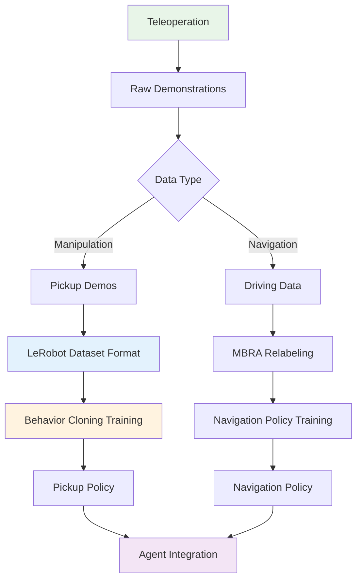

### Phase 1: Pickup Data Collection

**Objective**: Train a robust pickup policy for tissues and similar objects.

**Data Collection Process**:
1. **Setup**: Use SO100Leader to teleoperate LeKiwi arm
2. **Scenarios**: 100-300 successful picks across:
   - Different tissue placements (table, floor, shelf)
   - Varied backgrounds and lighting
   - Multiple tissue types/colors
   - Partial occlusions
3. **Recording**: Use `lerobot-record` with synchronized:
   - Wrist camera (preferred) + front camera
   - Joint positions (6-DoF)
   - Gripper commands
   - Success flags

**Command Example**:
```bash
lerobot-record \
  --robot.type=lekiwi \
  --robot.id=my_kiwi \
  --teleop.type=so100_leader \
  --teleop.port=/dev/tty.usbmodemXXXX \
  --teleop.id=my_leader \
  --output_dir=./data/lekiwi_pickup \
  --fps=30
```

**Dataset Schema**:
```python
{
    "action": [6],  # arm joint positions + gripper
    "observation.state": [6],  # current joint positions
    "observation.images.front": [480, 640, 3],
    "observation.images.wrist": [480, 640, 3],  # if available
    "timestamp": [1],
    "frame_index": [1],
    "episode_index": [1],
    "success": [1]  # boolean flag
}
```

### Phase 2: Leveraging Existing HF Data

**Available Dataset**: [shunsuke993/so100_pickup](https://huggingface.co/datasets/shunsuke993/so100_pickup)
- 26.9k samples, 30 FPS
- Front RGB + 6-DoF joint data
- Apache-2.0 license

**Joint Name Mapping**:
```python
HF_TO_LEKIWI_MAPPING = {
    "shoulder_pan.pos": "arm_shoulder_pan.pos",
    "shoulder_lift.pos": "arm_shoulder_lift.pos", 
    "elbow_flex.pos": "arm_elbow_flex.pos",
    "wrist_flex.pos": "arm_wrist_flex.pos",
    "wrist_roll.pos": "arm_wrist_roll.pos",
    "gripper.pos": "arm_gripper.pos"
}
```

**Usage Strategy**:
- Pretrain policy on HF data for general grasp priors
- Fine-tune on your LeKiwi-specific demonstrations
- Use for data augmentation and curriculum learning

### Phase 3: Navigation Data Collection

**Option A - Teach-and-Repeat (OmniVLA-inspired)**:
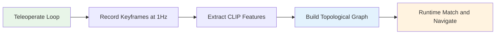

**Process**:
1. Manually drive robot around room/corridor
2. Save RGB frames every 1 second with pose estimates
3. Compute CLIP embeddings for visual similarity
4. At runtime: match current view to nearest keyframe, navigate to next node

**Option B - Learned Navigation (MBRA/LogoNav-inspired)**:
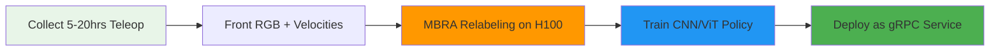

---

## Implementation Phases

### Phase 0: Prerequisites ✅

**Acceptance Criteria**:
- [ ] LeKiwi host runs stable for >30 minutes
- [ ] Teleoperation works (leader arm + keyboard base)
- [ ] Camera streams visible in Rerun
- [ ] Tailscale connectivity established

**Tasks**:
1. Verify hardware connections
2. Test ZMQ communication
3. Confirm camera feeds
4. Validate joint calibration

### Phase 1: MVP Agent 🚧

**Acceptance Criteria**:
- [ ] Robot responds to "fetch tissue" command
- [ ] Obstacle detection prevents collisions
- [ ] Visual servoing centers and approaches targets
- [ ] Scripted pick sequence completes
- [ ] Return-to-start functionality works

**Tasks**:
1. Implement basic FSM (`examples/lekiwi/autodrive.py`)
2. Add YOLO-based object detection
3. Create visual servoing controller
4. Script pick primitive
5. Add simple return navigation

### Phase 2: Data Collection 📊

**Acceptance Criteria**:
- [ ] 100+ pickup demonstrations recorded
- [ ] HF dataset successfully mapped to LeKiwi format
- [ ] Data quality validated (playback, statistics)
- [ ] Training pipeline tested

**Tasks**:
1. Set up recording infrastructure
2. Collect diverse pickup scenarios
3. Process and validate data
4. Create data loaders

### Phase 3: Learned Policies 🧠

**Acceptance Criteria**:
- [ ] Pickup policy achieves >80% success on held-out scenes
- [ ] Navigation policy (if used) reduces collisions vs heuristics
- [ ] Models run at required inference speed (>10 Hz)
- [ ] Integration with agent FSM complete

**Tasks**:
1. Train behavior cloning models
2. Validate on test scenarios
3. Optimize for inference
4. Integrate with agent

### Phase 4: Advanced Features 🚀

**Acceptance Criteria**:
- [ ] Voice commands work reliably
- [ ] Topological navigation enables room-scale tasks
- [ ] Error recovery and status communication clear
- [ ] System runs end-to-end for >1 hour

**Tasks**:
1. Add voice interface (Whisper)
2. Implement topological memory
3. Add error handling
4. System integration testing

---

## Engineering Guidelines

### Performance Requirements

```mermaid
gantt
    title Control Loop Timing
    dateFormat X
    axisFormat %L ms
    
    section 30 Hz Control
    Observation    :0, 10
    Perception     :10, 25
    Planning       :25, 28
    Action Send    :28, 33
    
    section Detector (10 Hz)
    YOLO Inference :0, 50
    Bbox Processing:50, 60
    
    section Policy (Variable)
    ACT Forward    :0, 80
    VQ-BeT Forward :0, 120
```

### Safety Considerations

1. **Speed Limits**:
   ```python
   SPEED_LIMITS = {
       "linear": {"min": -0.3, "max": 0.3},  # m/s
       "angular": {"min": -45, "max": 45},   # deg/s
       "joint_velocity": 0.5  # normalized/s
   }
   ```

2. **Watchdog Timers**:
   - Host stops base if no command for >500ms
   - Client timeout if no observation for >100ms

3. **Emergency Stops**:
   - Keyboard interrupt handler
   - Obstacle detection override
   - Joint limit enforcement

### Debugging and Monitoring

**Rerun Logging**:
```python
# Log all relevant data for debugging
log_rerun_data(
    observation=obs,
    action=action,
    detections=detections,
    fsm_state=agent.state,
    velocities=nav_commands,
    confidence=detector_confidence
)
```

**Status Dashboard**:
- Current FSM state
- Detector confidence
- Distance to target (bbox size proxy)
- Last error message
- System health metrics

---

## Cloud Inference + Onboard Reflex Safety

When running perception/policy on an H100 and streaming frames from the Pi, use a two‑layer controller: the cloud sends high‑level intents while the Pi enforces safety at high rate.

### Split of Responsibilities

- **H100 (Policy Server, 5–15 Hz)**: compute desired body velocity or waypoint and attach `{ts, ttl_ms, seq}`.
- **Pi (Host, 30–60 Hz)**: convert to wheel commands, apply ReflexGuard (safety checks, braking), drop stale commands, and smooth velocities.

### Sequence

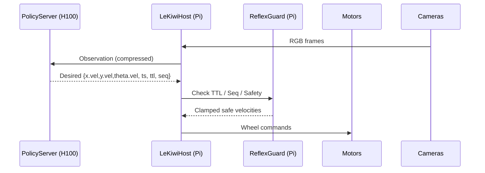

### Latency‑Aware Speed Limit

- Let measured end‑to‑end latency be \(L\) seconds (network + inference + loop).
- Braking distance: \(d_{brake} = \frac{v^2}{2 a_{brake}}\).
- Latency travel: \(d_{latency} = v (L + m)\), with margin \(m\in[0.1,0.2]\) s.
- Clearance estimate: \(d_{clear}\) (from depth or bbox proxy).
- Enforce: \(d_{latency} + d_{brake} \le d_{clear} - m_s\) → clamp \(v\) to \(v_{max\_safe}\).

### ReflexGuard (Pi)

- Central‑ROI obstacle check at 50–100 Hz; if risky → set `x.vel=0` immediately.
- Compute \(v_{max\_safe}\) and clamp `x.vel` each cycle.
- Drop stale commands: if `now - ts > ttl_ms` or `seq <= last_seq`.
- Low‑pass filter velocities and cap deceleration to \(a_{brake}\).
- Fallbacks: no fresh command >200 ms → decelerate to 0; >500 ms → watchdog hard stop.

### Cloud Policy (H100)

- Downscale frames (e.g., 320×240) and use JPEG quality 60–70 for policy input.
- Send desired `{x.vel, y.vel, theta.vel}` with `{ts, ttl_ms, seq}`.
- Run at 5–15 Hz; the Pi servos at 30–60 Hz.

### Recommended Starting Parameters

- Host loop: 30 Hz; ReflexGuard: 60 Hz; Policy: 10 Hz
- \(a_{brake}\): 0.8–1.2 m/s² (tune)
- Safety bubble \(d_{clear}\) target indoors: 0.4–0.6 m
- Latency margin \(m\): 0.1–0.2 s

### Test Plan

- Measure RTT + inference time; log moving average of \(L\).
- Drive toward a box; verify `x.vel` clamps as distance shrinks; unplug network → robot stops.
- Inject 200–300 ms artificial delay; ensure no overshoot.

---

## References

### Key Papers and Projects

1. **OmniVLA**: Omni-modal navigation with topological memory
   - [Project Page](https://omnivla-nav.github.io/)
   - Egocentric goal navigation, multi-modal conditioning

2. **MBRA + LogoNav**: Model-based reannotation for navigation
   - [Paper](https://arxiv.org/html/2505.05592v2)
   - Data relabeling and long-horizon policy training

3. **Gemini Robotics 1.5**: Agentic orchestration patterns
   - [Blog Post](https://deepmind.google/discover/blog/gemini-robotics-15-brings-ai-agents-into-the-physical-world/)
   - Voice → plan → tool-use → monitor

### Datasets and Models

4. **SO100 Pickup Dataset**: 
   - [HuggingFace](https://huggingface.co/datasets/shunsuke993/so100_pickup)
   - 26.9k samples, LeRobot format, Apache-2.0

5. **LeRobot Framework**: 
   - Existing policies: ACT, VQ-BeT, PI0, SmolVLA
   - Recording and training infrastructure
   - Standardized dataset formats

### Control Interfaces

**Base Velocities** (Mac → Pi):
```python
action = {
    "x.vel": 0.20,      # forward m/s
    "y.vel": 0.00,      # lateral m/s  
    "theta.vel": 15.0   # yaw deg/s
}
robot.send_action(action)
```

**Arm Positions** (degrees or normalized):
```python
arm_action = {
    "arm_shoulder_pan.pos": 5.0,
    "arm_shoulder_lift.pos": -3.0,
    "arm_elbow_flex.pos": 12.0,
    "arm_wrist_flex.pos": 0.0,
    "arm_wrist_roll.pos": 0.0,
    "arm_gripper.pos": 60.0,
}
robot.send_action(arm_action)
```

---

This document provides a comprehensive guide for implementing the LeKiwi agent system, from basic concepts to detailed implementation steps. Follow the phases sequentially, validate each milestone, and refer to the component specifications for detailed implementation guidance.
